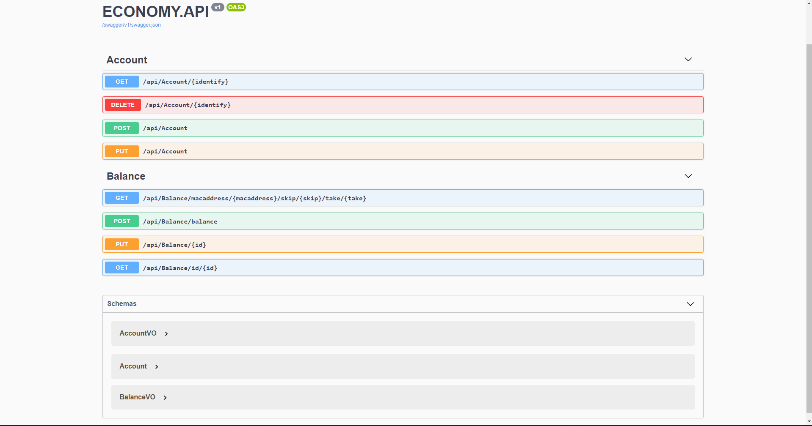

<h1>API REST com ASP NET WEB API</h1>

Esta api foi desenvolvida utilizando alguns conceitos absorvidos durante o período de estudos. Esta api será consumida por um aplicativo futuramente.

No desenvolvimento foi utilizado alguns conceitos intermediários referente a arquitetura e desempenho. O padrão arquitetural Value Object foi utilizado para criar uma camada parecida com a camada do banco de dados, sendo assim, não teremos como valor de entrada a mesma classe que representa o banco de dados. Junto a essa abordagem foi utilizado o automapper para fazer o mapeamento da classe VO com a classe que representa os dados no banco. 

Para realizar a abstração do controller com o banco de dados foi utilizado o padrão repository. Através da criação de interfaces que serão extendidas nas classes que farão parte desse repositorio. Sendo assim, o controller não precisa acessar diretamente o banco de dados, esse papel agora é responsabilidade das classes que implementam as interfaces. O controller fica responsável apenas por validar os dados recebidos pelo cliente.

Nas requisições GET para listagem das informações do banco de dados foi adotado a paginação para evitar que muitas informações sejam retornadas do banco de dados, evitando eventuais problemas de performance. Ainda falando sobre listagens, em informações que não são alteradas frequentemente mas que são solicitadas com mais frequencia, foi utilizado o cache de memoria para armazenar as informações que foram retornadas do banco de dados na memória, sendo assim, nas proximas requisições do tipo GET ao invés de fazer todo caminho ao banco de dados para retornar as requisições o cache de memória terá essas informações armazenadas e poupará esse acesso direto ao banco de dados 

O banco de dados utilizado foi o SQL Server junto ao ORM Entity framework para auxiliar na criação do esquema do banco de dados. Baseado no conceito code first, onde criamos uma classe que será a representação do banco de dados

